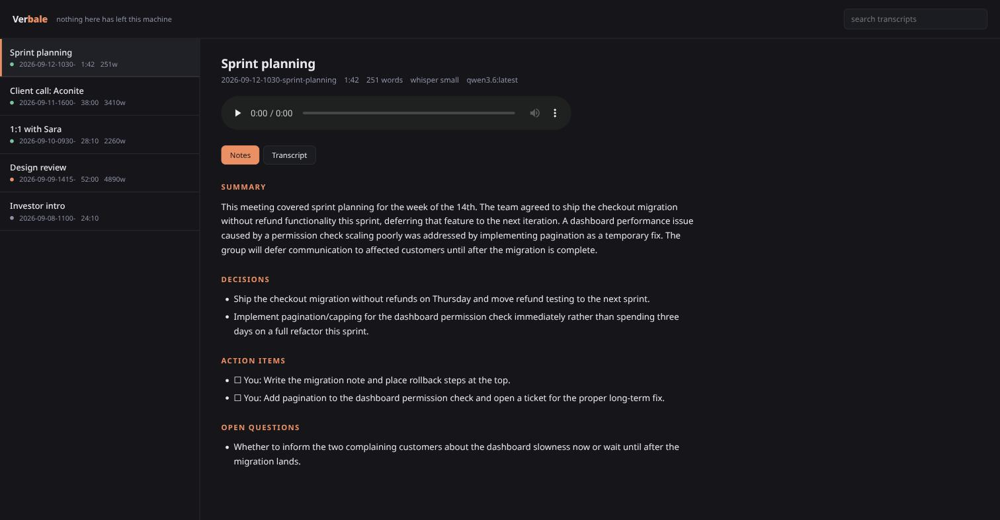
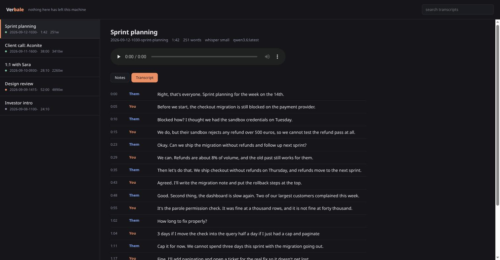

<h1 align="center">Verbale</h1>

<p align="center">
  <b>Meeting notes that never leave your machine.</b><br>
  Records the call, transcribes it, and writes the minutes. Entirely offline, on your own hardware.
</p>

<p align="center">
  <a href="https://marcozorn.github.io/verbale/">Website</a> ·
  <a href="#install">Install</a> ·
  <a href="#how-it-works">How it works</a> ·
  <a href="#privacy">Privacy</a>
</p>

<p align="center">
  
</p>

Every meeting-notes product wants your audio on its servers. Verbale records
the meeting, runs Whisper on your CPU, asks a model already running on your
laptop to write the minutes, and puts the result in a folder. No account, no
API key, no upload, no subscription. Turn off your wifi and it still works.

```
$ verbale record "Sprint planning"

  ● 42:19

saved ~/.local/share/verbale/2026-09-12-1030-sprint-planning  (42:19)
transcript 6120 words, 218 turns
notes ~/.local/share/verbale/2026-09-12-1030-sprint-planning/notes.md
```

## Who is speaking, without diarization

This is the part worth understanding, because it is what makes the transcripts
readable.

Telling speakers apart normally means diarization: a second model that
clusters voices by timbre, gets confused by cross-talk, and disagrees with
itself about how many people are in the room.

Verbale does not do any of that. On PipeWire and PulseAudio, every output
device exposes a `.monitor` source carrying exactly what is being played, so
Verbale records **two tracks at once**: your microphone, and everything your
speakers played. Your voice is only ever on one of them and the other side is
only ever on the other. Speaker attribution is not inferred, it is a fact of
how the audio was captured.

Both tracks come from one `ffmpeg` process with two inputs, so they start
together and stay aligned. Two processes would drift apart by however long the
second took to launch, and a transcript whose speakers are half a second out of
order reads like nonsense.

The honest limitation: `Them` is one label for everyone on the far end. For
minutes, "who said it, me or them" is usually the distinction that matters, and
it is better to be right about that than to guess wrong about four voices.

## Install

Requires Linux with PipeWire or PulseAudio, plus `ffmpeg`.

```bash
pipx install git+https://github.com/MarcoZorn/verbale
verbale pull                # fetch the Whisper weights once
verbale doctor              # check everything is in place
```

<sub>A PyPI release is coming; until then install from the repository.</sub>

For the summaries, [Ollama](https://ollama.com) with any model you like:

```bash
ollama pull qwen3:8b
```

Without Ollama you still get full transcripts; only the minutes are skipped.

```
$ verbale doctor

Verbale 0.1.0

  ok   ffmpeg /usr/bin/ffmpeg
  ok   pactl /usr/bin/pactl
  ok   audio output alsa_output.pci-0000_00_1f.3.HiFi__Speaker__sink.monitor
  ok   microphone alsa_input.pci-0000_00_1f.3.HiFi__Mic1__source
  ok   faster-whisper model 'small'
  ok   ollama 7 models at http://127.0.0.1:11434
  ok   data directory /home/marco/.local/share/verbale
```

## Use it

```bash
verbale record "Standup"     # ctrl-c to stop, then it transcribes and summarises
verbale list                 # everything recorded
verbale show                 # the latest meeting's notes
verbale show --transcript    # the full transcript instead
verbale web                  # read them in a local page
```

Re-run a step whenever you want, for instance after switching to a bigger model:

```bash
verbale transcribe 2026-09-12   # ids can be shortened, or matched by name
verbale notes sprint
```

Already have a recording from somewhere else:

```bash
verbale import ~/Downloads/call.m4a --name "Client call"
```

## What you get

One directory per meeting, and nothing that needs Verbale to read it:

```
~/.local/share/verbale/2026-09-12-1030-sprint-planning/
├── meeting.json      what it is, how long, which models touched it
├── them.wav          what your speakers played
├── you.wav           what your microphone heard
├── transcript.json   segments with timings and speakers
├── transcript.md     the same thing, readable
└── notes.md          the minutes
```

A notes tool you cannot get your notes out of is a liability. This one is `cat`.

`notes.md` has a fixed shape, so it stays skimmable and diffable:

```markdown
## Summary
## Decisions
## Action items
## Open questions
```

## The local viewer

`verbale web` serves a page on `127.0.0.1:7777` that reads the same directory.
Click any timestamp in the transcript and the recording jumps there.

<p align="center">
  
</p>

Standard library only, no external assets, no tracking, bound to loopback.

## How it works

```
 microphone ─┐                          ┌─ you.wav ───┐
             ├─ one ffmpeg, two tracks ─┤             ├─ faster-whisper ─┐
 speakers ───┘                          └─ them.wav ──┘                  │
                                                                         ▼
                        notes.md ◀── Ollama (localhost) ◀── merged transcript
```

1. **Capture.** Two PulseAudio sources, one `ffmpeg`, 16 kHz mono, which is
   exactly what Whisper wants so nothing is resampled later.
2. **Transcribe.** faster-whisper on each track, with voice activity detection.
   VAD matters more than usual here: each track is silent while the other person
   talks, and Whisper will otherwise invent a polite sentence into that silence.
3. **Merge.** Segments from both tracks are interleaved by timestamp, and runs
   from the same speaker less than 1.2 s apart are joined, because Whisper
   splits on breath pauses and a transcript broken every four words is unreadable.
4. **Summarise.** The transcript goes to Ollama on localhost. Long meetings are
   split on speaker boundaries, summarised in parts, then merged, because a
   mid-sized local model quietly forgets the beginning of a two hour call.

## Privacy

- The only network calls this program makes are to `127.0.0.1:11434`, your own
  Ollama. You can read all of `verbale/summarize.py` in two minutes to confirm it.
- The one exception is the first run, which downloads the Whisper weights from
  Hugging Face. Do it deliberately with `verbale pull`, then stay offline forever.
- Nothing is ever sent anywhere else. There is no telemetry, no crash reporter,
  no account, and no code path that could add one without you noticing it in the diff.
- The web viewer binds to loopback. If you pass a different `--host` it says so.

## Configure

```bash
verbale config --write     # writes the defaults to ~/.config/verbale/config.json
```

| option | default | what it does |
|---|---|---|
| `whisper_model` | `small` | `tiny`, `base`, `small`, `medium`, `large-v3`. `base` mangles names often enough to make notes untrustworthy |
| `whisper_device` | `auto` | `cpu`, `cuda` |
| `language` | `""` | empty means detect |
| `ollama_model` | `qwen3.6:latest` | any model you have pulled |
| `you_label` / `them_label` | `You` / `Them` | put real names here if you like |
| `port` | `7777` | the local viewer |

## Development

```bash
git clone https://github.com/MarcoZorn/verbale && cd verbale
uv venv --python 3.12 && uv pip install -e ".[dev]"
pytest
```

The two-track merge is the part that would silently ruin every transcript if it
broke, so that is where the tests are.

## Limits, honestly

- Linux only for recording. The capture layer is PulseAudio and PipeWire.
  `verbale import` works anywhere Python and ffmpeg do.
- `Them` is one label for the whole far end.
- Quality is Whisper's quality. Accents, crosstalk and jargon all cost accuracy,
  and `small` on a busy call is good, not perfect.
- The summary is only as good as the local model you point it at.
- Recording people has rules that vary by country, and in several of them all
  parties must consent. That is your call to make, not this program's.

MIT.
